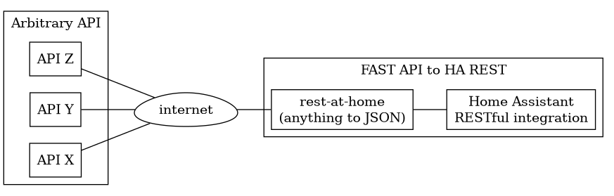

# rest-at-home

Home assistant has nice integration for [rest](https://www.home-assistant.io/integrations/rest/) API(s).
However, there are some API(s) I would like to consume in Home assistant that do not offer a rest interface.
So this project provides the in between with python and [Fast API](https://fastapi.tiangolo.com/).



Youll have to run a Fast API server to make this happen but there should be no upper limit on how many API(s) can be converted this way.

# Deploy

Make the bin

```
uv sync --frozen  
```

Install the unit and timer files

```
cp rest-at-home.service rest-at-home.timer ~/.config/systemd/user/ 
cp rest-at-home-api.service ~/.config/systemd/user
```

Enable and start the timer and service

```
systemctl --user enable --now rest-at-home.timer
systemctl --user enable --now rest-at-home-api.service
```

Check timer

```
systemctl --user list-timers rest-at-home.timer
```
