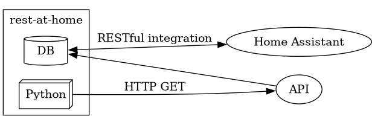

# rest-at-home

Home assistant has nice integration for [rest](https://www.home-assistant.io/integrations/rest/) API(s).
However, there are some API(s) I would like to consume in Home assistant that do not offer a rest interface.
So this project provides the in between with python and [Fast API](https://fastapi.tiangolo.com/).


Youll have to run a Fast API server to make this happen but there should be no upper limit on how many API(s) can be converted this way.

# Deploy

Make the bin

```
uv sync --frozen  
```

Install the unit and timer files

```
cp rest-at-home.service rest-at-home.timer ~/.config/systemd/user/ 
cp rest-at-home-api.service ~/.config/systemd/user
```

Enable and start the timer and service

```
systemctl --user enable --now rest-at-home.timer
systemctl --user enable --now rest-at-home-api.service
```

Check timer

```
systemctl --user list-timers rest-at-home.timer
```

# Architecture

There are two major components, **API** and **Sync**.

**API**    Responsible for interfacing with Fast API, specifically the RESTful interface.

**Sync**   Responsible for updating the local data cache.



## API

Implemented as a Fast API application.
Reads from the database the API data in native format, the translation happens at request time.

The uvicorn web server is managed as a systemd service.

## Sync

Implemented with a single python function, it is availble as a uv script entry point.
Uses requests to write the API data to the database in the native format.

## Database

Currently implemented with files on the file system.
The root directory of this project is primary working directory.

## TODO

- do the data conversion in Sync and not in API
- upgrade the database to an in memory database
